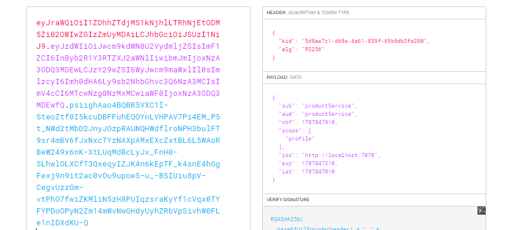
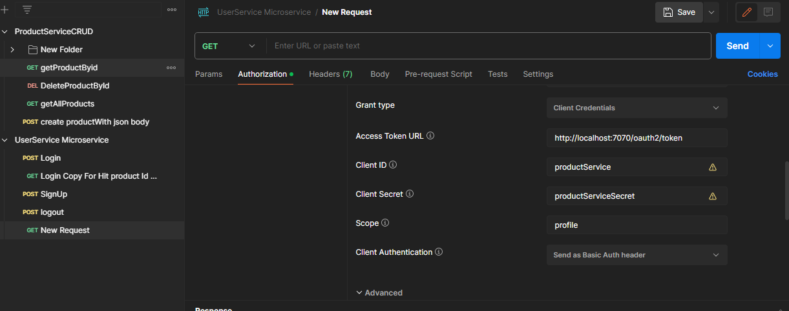
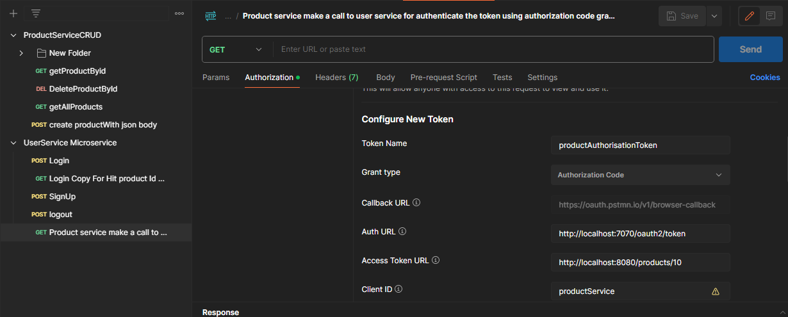
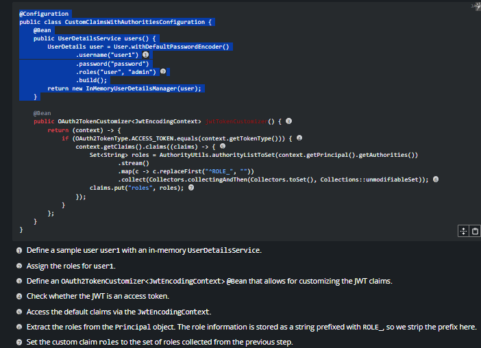

1. create 
          

          1. create models , dtsos , controllers, services
           https://github.com/jwtk/jjwt?tab=readme-ov-file#features

2. class creating JWT token for authenticating from server
   for muliple time login by user using token 

          

3. CLASS : DAY 205, 22 DEC
   Backend Projects: Implementing Search - Paging, Sorting, Elastic Search
           
            CONNECT TWO MICROSERVICES productServices and userService and done lot of  modification 
            there two connect them 
            JWTObject {
         +  // NOTE 24 UP:
           +  // this will return in the DTO
             +  // After validation of the validate method it should return
             +  // some kind of message or that validate successfully
          okenValidator {
            +  // NOTE 22 UP: this are the models which are common for both
              +  // microservices ProductService and UserService
              +  // this are kept in some common place to access by all
              +  // and this are actually service
              + NOTE 21 UP: add String authToken and refactor each place

       / if we need to extract the key value pair that is inside the token payload then we can
           // parse the token and find the correponding value like email, roles, date time etc
                  

             // NOTE 18:
+        // what are token validation need to validate for a particular thing to access
      +    // that should be present here

Class : Finishing Authentication Service
      successfully generate the oauth token 
      1. we did the over ride functionality of spring boot security of user and userDetails
         2. we create the custom user and userDetails and from db we can call it insteed of 
         3. in memory authorization 
         4. When product service want to call userservice and if the token is not  
         5. is not passed as input then Oauth2 is help to redirect the page to login one
         6. and we can use product service
         
      

      

"class : Auth Service Continued , here we used some pre implemented class to store the gene
rate token by the postman to the db by modifying different service "

class :  Auth Service Finish
Error : No AuthenticationProvider found for org.springframework.security.authentication.UsernamePasswordAuthenticationToken
I found the root cause.
If you create your own UserDetailsService bean, there is no need to manually define a bean for AuthenticationProvider, cos by default a DaoAuthenticationProvider bean will be automatically created for us, which will automatically pick up your defined UserDetailsService bean.
But if you define 2 or more UserDetailsService beans, then u need to define your own Authenticationprovider. I made a mistake, as i don't realize I have another class that implements UserDetailsService interface and annotated with @service , which create a second UserDetailsService bean.

